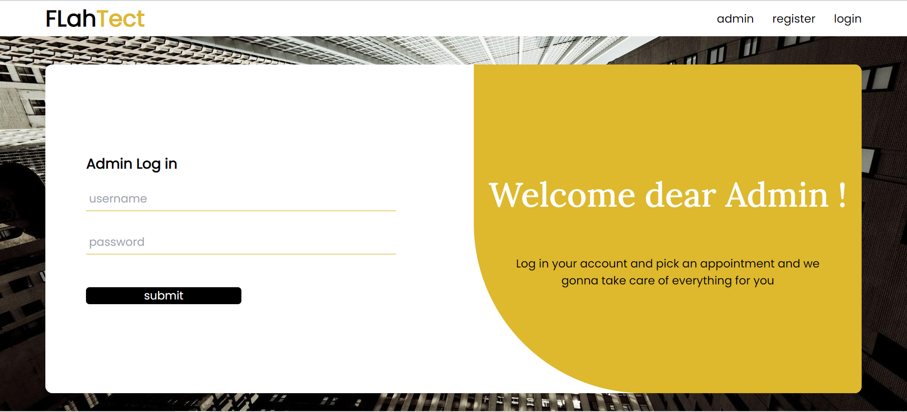
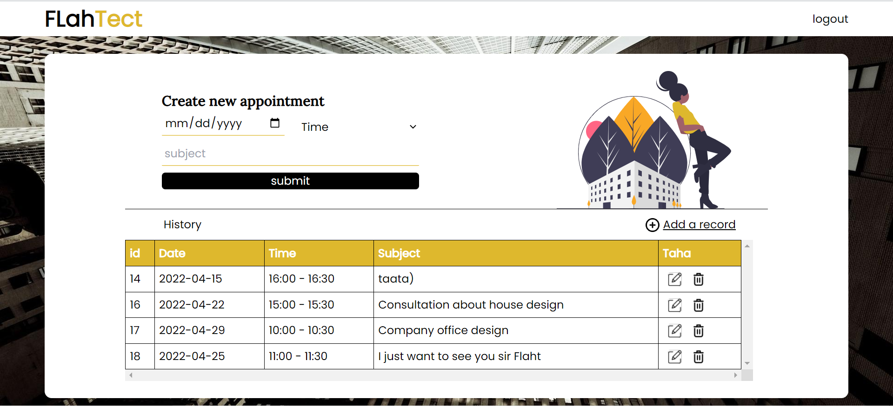

# FlahTec
Appointment management of the architect Mr "Ahmed Flaht" 

## Technology Stack :
**Front-end** : React.js - SASS 
**Back-end & api** : Native php with MVC Design pattern 
**Authorization** : JWT 

## Features :
### client :
1. Take an appointment 
   - the date must superior of today's date
   - the time slot must be empty
2. Update or delete an appointment
   - must be of a date superior of today's date 

_Note that the available time slots are_ :

    - N°1 de 10 h à 10:30h
    - N°2 de 11 h à 11:30h
    - N°3 de 14 h à 14:30h
    - N°4 de 15 h à 15:30h
    - N°5 de 16 h à 16:30h   

### Admin :
1. In charge of client management